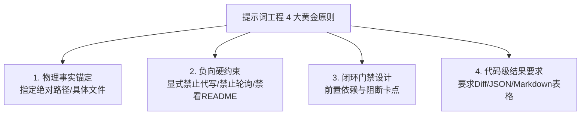

# 🛠️ Script Reviewer 技能开发、测试与工程审计提示词指南

> 本文档整理并系统润色了在 `script-reviewer` 插件开发、调试验证、轨迹审计及端到端落地过程中沉淀的高效提示词（Prompts）。文档按**研发全生命周期**划分为 5 大核心场景，包含原始提示词、润色推荐版、设计意图及工程技术解析，供后续维护、升级与开发其他复杂 Agent 插件时作为标准化参考。

---

## 📑 目录

1. [场景 1：技能架构与执行全链路逆向分析](#-场景-1技能架构与执行全链路逆向分析)
2. [场景 2：基于真实案例的决策流与节点驱动剖析](#-场景-2基于真实案例的决策流与节点驱动剖析)
3. [场景 3：工业级端到端剧本审稿一键触发](#-场景-3工业级端到端剧本审稿一键触发)
4. [场景 4：会话历史轨迹 (Trajectory) 逆向审计与质量复盘](#-场景-4会话历史轨迹-trajectory-逆向审计与质量复盘)
5. [场景 5：多智能体防架空与物理落盘严密性穿透审查](#-场景-5多智能体防架空与物理落盘严密性穿透审查)
6. [💡 提示词工程核心设计原则 (Prompt Design Principles)](#-提示词工程核心设计原则)

---

## 🔍 场景 1：技能架构与执行全链路逆向分析

### 📝 原始提示词
```text
深入分析技能script_reviewer，目前的运行逻辑执行全链路流程是什么。请严格按照当前skills内容说明，禁止参考readme.md文档内容
```

### ✨ 润色推荐版

#### 【推荐 A · 研发架构基线对齐版】
```text
请对 script-reviewer 插件体系进行深度架构逆向分析，详细梳理当前的执行全链路流转机制。

【硬性约束】：
1. 严格以 skills/ 目录下的 SKILL.md、references/ 以及配套 Python 脚本为唯一事实来源（Single Source of Truth）；
2. 严禁参考或引用 README.md 中的宣发描述，确保分析完全基于底层真实代码与规约；
3. 输出内容需覆盖：主控（Lead）调度逻辑、4 大专家子 Agent 职责边界、纯 Markdown 台账演进机制、物理落盘触发条件及全流程四阶段（Phase 1~4）的详细数据流。
```

#### 【推荐 B · 流程图解与状态流转版】
```text
请从架构师视角深入解构技能 script-reviewer 的全链路运行逻辑：
1. 绘制端到端多智能体协同的时序与数据流转图（Mermaid 格式）；
2. 逐一说明从输入长剧本文档到最终产出白皮书的各阶段（Phases）输入、处理逻辑与输出产物；
3. 严格基于当前 skills 定义与脚本源码说明，禁止依赖 README.md 描述。
```

### 🧠 设计意图与工程原理
> [!NOTE]
> **为什么要加“禁止参考 readme.md”？**
> 在复杂的智能体系统迭代中，`README.md` 往往包含主观宣发词或版本滞后信息。通过显式下达“禁止参考 README、强制读取 `SKILL.md` 与脚本源码”的负向指令，能强迫大模型直接阅读最底层的规约文件与 Python 代码，消除语义幻觉，获取 100% 真实的工程现状。

---

## 🧩 场景 2：基于真实案例的决策流与节点驱动剖析

### 📝 原始提示词
```text
深入分析技能script_reviewer，请使用案例举例说明一个完整剧本在触发审核工作流后，具体是由skills中的哪些内容决定流程节点走向最终完整执行全流程的。请严格按照当前skills内容说明，禁止参考readme.md文档内容
```

### ✨ 润色推荐版

#### 【推荐 A · 案例决策树穿透版】
```text
请结合一个具体剧本案例（如 18 集微短剧），深度剖析 script-reviewer 审核工作流的动态决策机制：

【核心审查点】：
1. 载体识别与分章决策：skills 中的哪些正则规则与参数配置决定了 script_splitter 的切分粒度（如短剧 10 场/长剧 15 场/集数标记）？
2. 双模自适应切换：子 Agent 是如何根据输入中是否包含历史台账，自动在 Mode A（全局连续性模式）与 Mode B（单场盲审模式）之间切换的？
3. 状态机流转依据：每一轮审稿中，台账条目由待回收 [+] 到闭环 [✓] 或硬伤 [🚨] 的判定依据是什么？
4. 门禁阻断逻辑：哪些条件会触发批次写盘门禁（Batch Gate），阻断 Agent 越权推进？

请严格基于当前 skills 规则定义逐项溯源说明，禁止参考 README.md。
```

#### 【推荐 B · 状态机全生命周期追踪版】
```text
请以一部典型剧本的端到端审查为实例，自下而上拆解 script-reviewer 体系中驱动流程推进的关键代码与规约规则：
1. 详细列出从 Phase 1 到 Phase 4 每个节点的“触发条件 ➔ 决策规则 ➔ 执行动作 ➔ 产物落盘”；
2. 重点展示一条伏笔（F-01）与一个道具（P-01）在经历 6 个批次审查中的真实状态演进轨迹；
3. 严格依据 skills 内部文件逻辑进行事实核验。
```

### 🧠 设计意图与工程原理
> [!TIP]
> **案例化决策树分析的价值**：
> 纯理论分析容易遗漏边界条件。通过指定具体业务案例（如多集短剧），可以检验 skills 中正则表达式的覆盖率、自适应模式（Mode A vs Mode B）的触发灵敏度，以及台账状态机在跨多轮交互中是否具备严密的单向流转特性。

---

## 🚀 场景 3：工业级端到端剧本审稿一键触发

### 📝 原始提示词
```text
请审查我的剧本：D:\dev\project\doc\inbox\创业 - AI短剧 漫剧 - 剧本 - 爷爷的旧军帽.md
```

### ✨ 润色推荐版

#### 【推荐 A · 工业级标准一键托管版（最稳健）】
```text
请调用 script-review-lead 对剧本《爷爷的旧军帽》启动端到端全自动审稿流水线：

【项目信息与参数】：
- 剧本物理路径：`D:\dev\project\doc\inbox\创业 - AI短剧 漫剧 - 剧本 - 爷爷的旧军帽.md`
- 作品载体类型：微短剧 (`short_drama`)
- 分批策略：按每 3 集为一个并发审查批次 (`ep_001_003`, `ep_004_006` ...)

【执行标准与交付物要求】：
1. 严格遵循 Phase 1~4 标准流水线，执行本地分章落盘与四大资产总台账初始化；
2. 针对各批次真实调用 invoke_subagent 并发调度 4 大专家子 Agent，坚守批次写盘门禁；
3. 遵循台账演进四大铁律，自动归档满 10 集里程碑快照；
4. 完成全剧宏观复盘，物理落盘 final_whitepaper.md 至工作区根目录并生成交互式 Artifact。
```

#### 【推荐 B · 极简指令版（快速触发）】
```text
请对剧本 D:\dev\project\doc\inbox\创业 - AI短剧 漫剧 - 剧本 - 爷爷的旧军帽.md 执行工业级全自动审稿（载体：微短剧）。要求完成本地分章、4 专家并发审查、纯 Markdown 台账增量演进与全剧白皮书交付。
```

### 🧠 设计意图与工程原理
> [!IMPORTANT]
> **工程参数明确化的重要性**：
> 明确指定“载体类型（`short_drama`/`series`/`movie`）”和“分批策略”，能让主控 Agent 准确向 `script_splitter.py` 传入 `--type` 参数，避免由于长短剧判定模糊导致切分粒度不当。

---

## 🔬 场景 4：会话历史轨迹 (Trajectory) 逆向审计与质量复盘

### 📝 原始提示词
```text
ID为a9751501-3994-4e43-b919-43b1717daab8的conversations，是我最新一次测试过程，请带着审视的眼光分别逐一对链路执行流程深度审查，流程是否符合预期
```

### ✨ 润色推荐版

#### 【推荐 A · 全景门禁穿透审计版】
```text
请对会话记录（Conversation ID: `a9751501-3994-4e43-b919-43b1717daab8`）的执行轨迹开展深度逆向工程审查，严密核验其全链路执行是否符合 script-reviewer 规约：

【重点审查维度】：
1. 智能体反架空核查：Lead Agent 是否真实调用了 invoke_subagent 唤醒 4 位独立专家？是否存在主模型违规代写或编写脚本伪造报告的行为？
2. 门禁与事件驱动核查：子 Agent 派发后是否遵循零轮询原则（无 schedule / 无 sleep）？每批收到报告后是否在当次回合立即调用 batch_writer.py 完成写盘？
3. 台账状态机完整性：核验 global_ledgers.md 在各批次演进中是否遵循四大铁律（全量继承无丢行、ID 单调递增、LOCKED 项未篡改、Changelog 完整落盘）；
4. 物理产物与路径规范：核查 episodes/、reports/、ledgers/、snapshots/ 及 final_whitepaper.md 的磁盘落盘路径是否 100% 符合工作区标准。

请列出详细的执行步骤还原表、合规判定矩阵及发现的偏差优化建议。
```

#### 【推荐 B · 缺陷溯源与性能排查版】
```text
请读取 Conversation ID `a9751501-3994-4e43-b919-43b1717daab8` 对应的底层轨迹数据库，进行全量步骤逆向审计：
1. 提取所有 Step 的工具调用序列（run_command / invoke_subagent / write_to_file）；
2. 重点排查是否存在重复调用、超时报错、格式解析异常或写盘遗漏；
3. 输出《测试会话质量审计白皮书》，明确给出“符合/存在偏差”的判定依据。
```

### 🧠 设计意图与工程原理
> [!NOTE]
> **为什么要让 AI 逆向审查自身的 Trajectory DB？**
> Antigravity 将每一次交互的工具调用参数、返回值与 Token 消耗持久化在本地 SQLite 数据库中。通过精准指定 Conversation ID 提取 Protobuf 轨迹，可以穿透模型表面的回答文字，以物理事实核查是否存在“假并发”、“虚假落盘”或“丢行”等静默失败（Silent Failures）。

---

## 🛡️ 场景 5：多智能体防架空与物理落盘严密性穿透审查

### 📝 原始提示词
```text
请带着审视的眼光，多维度全面审查这套skills库执行流程的每个节点逻辑的严密性，比如 “物理写盘增量变更: ledgers/changelog_ep_i.md ”是否能被最终落实 等
```

### ✨ 润色推荐版

#### 【推荐 A · 闭环鲁棒性与防悬空审查版】
```text
请以严苛的白盒审计视角，多维度全面审查 script-reviewer 技能库各执行节点的逻辑严密性与闭环可靠度：

【重点穿透审查项】：
1. 物理写盘确定性：规约中要求的 `reports/report_ep_*.md`、`ledgers/changelog_ep_*.md`、`ledgers/global_ledgers.md` 是否有强约束的代码或工具调用保证其必被执行，而非仅停留在 Prompt 口头承诺？
2. 跨批次状态丢失防御：长剧集在经历 10 轮以上连续交互时，是否存在由于上下文压缩导致历史台账丢行、断号的漏洞？快照机制（Snapshots）是否具备边界容错？
3. 异常与断点恢复：若某一子 Agent 执行报错或网络超时，流水线是否有重试、降级或断点续审机制？
4. 双模（Mode A vs Mode B）边界：当输入剧本格式非标准或无场头时，各专项技能是否存在报错崩溃或模式误判风险？

请输出《技能库逻辑严密性审计报告》，指出潜在的逻辑薄弱点并附上加固代码/规约方案。
```

#### 【推荐 B · 攻防对抗与边界压力测试版】
```text
请对 script-reviewer 体系进行“红蓝对抗”式的逻辑漏洞挖掘：
- 尝试找出 3~5 个可能导致该工作流“假装写盘”、“台账表格破损”、“子智能体被架空”或“长上下文失忆”的边界脆弱点；
- 结合 batch_writer.py 与 SKILL.md，逐一给出代码级与规约级的防御加固建议。
```

### 🧠 设计意图与工程原理
> [!TIP]
> **防范“Prompt 假落实”的工程心法**：
> 大模型在处理复杂长流程时容易出现“口头说已写盘，实际未调用工具落盘”的幻觉。审查提示词通过指名具体的物理文件路径（如 `changelog_ep_i.md`），迫使 Agent 沿着“规约定义 ➔ 工具绑定 ➔ 参数传递 ➔ 脚本执行 ➔ 结果验证”的代码闭环进行推演，从根本上杜绝流程悬空。

---

## 💡 提示词工程核心设计原则 (Prompt Design Principles)

在开发与调试复杂 Agent 技能时，建议遵循以下 **4 大黄金原则**：



1. **物理事实锚定 (Grounding in Physical Artifacts)**：
   - 避免模糊的“请分析剧本”，始终给出绝对文件路径、集数批次与具体产物路径。
2. **负向硬性约束 (Explicit Negative Constraints)**：
   - 当需要获取客观事实时，显式下达负向指令（如“禁止参考 README”、“严禁轮询”、“严禁越权代写”），可大幅降低模型的模式化套话。
3. **闭环门禁设计 (Execution Gates & Blocking Points)**：
   - 在提示词中树立“未完成 A 严禁执行 B”的强依赖逻辑，迫使 Agent 按确定性状态机推进。
4. **代码级结果要求 (Code-Level Actionable Output)**：
   - 要求输出具体 Unified Diff、Markdown 表格或直接调用脚本落盘，拒绝空洞的定性建议。

---

© 2026 Script Reviewer Plugin Development Team · 提示词工程实战指南
